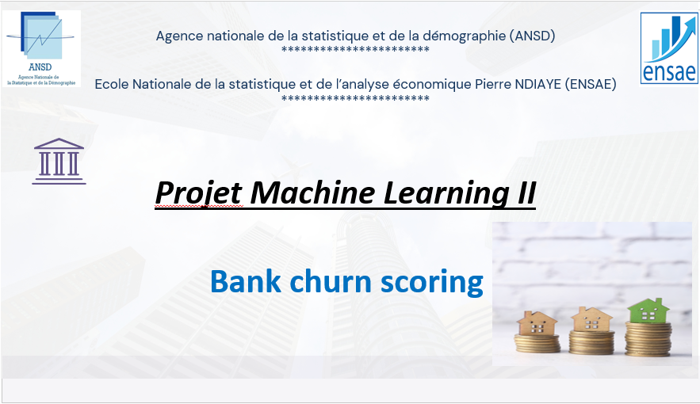

# Bank Churn Scoring

## 🎯 Objectif du projet

Ce projet a pour but de :

* **Identifier les facteurs clés** qui influencent l’attrition des clients bancaires.
* **Prédire les départs potentiels** des clients afin d’aider les banques à améliorer la fidélisation.
* **Mettre en place un système de scoring** pour anticiper les risques de départ.

---

## 🧠 Contexte

L’attrition des clients est un défi majeur pour les institutions financières. Grâce au machine learning, il est possible de développer des outils de **clustering**, de **scoring** et de **prédiction** pour détecter en amont les clients susceptibles de quitter la banque.

---

## 🗃️ Données utilisées

* **Nombre d'observations** : 165 034
* **Variables** : 12 (quantitatives et qualitatives), plus un identifiant
* **Variable cible** : `Exited`
* **Qualité des données** : Pas de valeurs manquantes ni de doublons

---

## 🔍 Analyse exploratoire

* Répartition de la variable cible
* Distribution des variables quantitatives
* Comparaisons croisées avec la variable cible (`Exited`)
* Matrices de corrélation

---

## ⚙️ Méthodologie

1. **Prétraitement** des données (équilibrage, encodage, etc.)
2. **Rééchantillonnage** pour données déséquilibrées
3. **Construction de pipelines** pour automatiser le tuning des modèles
4. **Évaluation** via différentes métriques :

   * Precision
   * Recall
   * F1\_macro
   * F2\_macro
   * Accuracy

---

## 🤖 Modèles testés

* Régression Logistique
* Arbre de Décision
* Naive Bayes
* Perceptron
* K-plus proches voisins (KNN)
* Random Forest
* XGBoost

---

## 🏆 Meilleur modèle

* **Random Forest**

  * Accuracy : **81.9%**
  * Recall : **79.6%**

---

## 📊 Déploiement / Dashboard

Le modèle retenu a été intégré dans un dashboard interactif permettant une visualisation dynamique des résultats et un système d'alerte pour anticiper les départs de clients.

---

## 👥 Équipe projet

**Présenté par** :

* **Famara SADIO**
* **Saran NDIAYE**
* **Sié Rachid TRAORE**
* **Amadou YOUM**

**Supervision** :

* *Madame Mously DIAW*,Data scientist / ML Engineer / Auto-Entrepreneur

---

## 📎 Licence

Projet réalisé à des fins pédagogiques dans le cadre du cours de **Machine Learning II** à l’ENSAE Pierre NDIAYE en partenariat avec l’ANSD.
